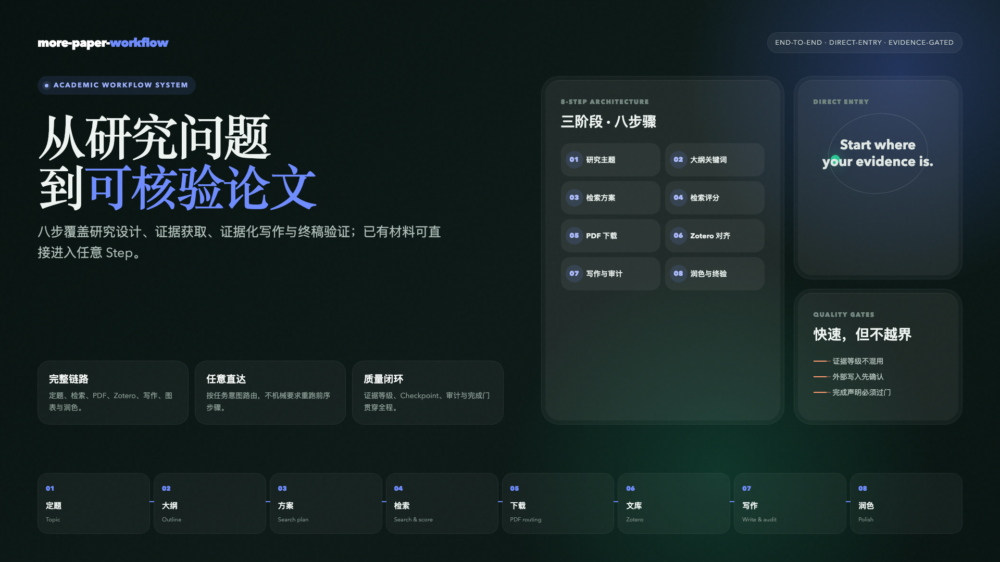
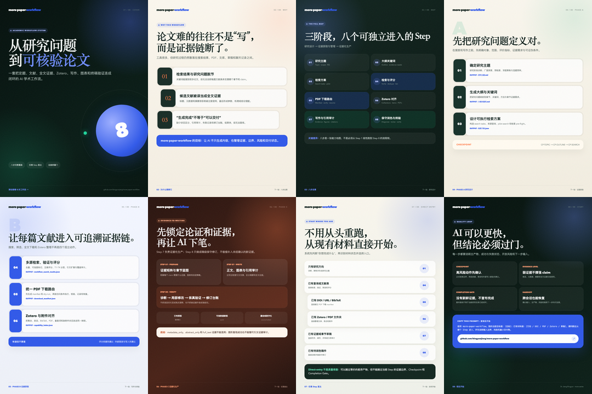

[](https://github.com/bingyunjiang/more-paper-workflow)
[](https://github.com/bingyunjiang/more-paper-workflow)
[](https://github.com/nousresearch/hermes-skills)
[](https://github.com/openclaw/openclaw)
[]()
[](LICENSE)
[]()

# more-paper-workflow `v1.0.22-20260724`

> 从研究问题到可核验论文：一套支持任意步骤直达、证据分级和质量闭环的学术论文工作流。
>
> From research question to verifiable paper: start from any Step, keep evidence visible, and close every quality gate.

<p align="center">
  
</p>

`more-paper-workflow` 不把论文简化成“一键生成文本”。它把定题、大纲、检索、PDF、Zotero、写作、科研图表、引用审计和保守润色连成一条可追溯链路。

已有 DOI、PDF、Zotero 文库或草稿？你可以直接进入对应 Step，不必机械重跑前序流程；但证据边界、Checkpoint 和 Completion Gate 不会被跳过。

**English readers:** start with the [English summary and copy-ready prompts](#english).

**[快速开始](#快速开始)** · **[八步工作流](#八步工作流)** · **[安装](#安装)** · **[English](#english)** · **[完整流程图](docs/public-workflow-flowcharts.md)** · **[最小样例](examples/first-run/README.md)**

---

## 为什么需要它

*Why it matters: useful academic writing keeps research questions, evidence, claims and deliverables connected.*

论文真正困难的地方，通常不是“写出一段话”，而是下面几个问题：

- 检索结果能否对应研究问题和章节证据需求？
- 引用是否来自真实、匹配且读到足够深度的文献？
- 草稿、图表和修订是否达到可以交付的状态？

本工作流默认采用：**先发散、后收敛、候选池先保留**。每一步都明确**输入边界、候选池、输出工件和失败回退**：先把主题、假设、路线和反例放进候选池，再把当前轮收敛成一个执行包。

### 三个核心差异

*Three practical differences*

| 能力 / Capability | 常见 AI 写作方式 / Typical AI writing | more-paper-workflow |
| --- | --- | --- |
| 工作范围 / Scope | 从主题直接生成正文 | 从定题到终验的现有 8 步工作流 |
| 证据使用 / Evidence | 容易混用标题、摘要和全文 | 明确区分候选、元数据、摘要和全文证据 |
| 任务状态 / Status | 生成结束即视为完成 | 区分草稿、风险、失败、待人工和可交付状态 |
| 进入方式 / Entry | 从头执行固定流程 | 依据现有材料 direct-entry |
| 高风险动作 / Risk | 容易静默继续 | 登录、外部写入和弱证据使用前明确确认 |

---

## 八步工作流

*Eight Steps · Direct Entry · Evidence-Grounded*

| 阶段 / Phase | Step | 解决的问题 / Purpose | 主要产物 / Outputs |
| --- | --- | --- | --- |
| 研究设计 / Research design | 1 · 研究主题 / Topic | 研究什么、边界在哪里、如何证伪 | `研究主题.md` |
| 研究设计 / Research design | 2 · 大纲关键词 / Outline | 章节如何承接 RQ 和证据需求 | `大纲关键词.md`、`section_blueprints.json` |
| 研究设计 / Research design | 3 · 检索方案 / Search plan | 如何形成可执行、可复核的查询 | `检索方案.json`、`compiled_queries.json` |
| 证据获取 / Evidence acquisition | 4 · 检索评分 / Search & score | 如何检索、核验、去重、评分与分层 | `workflow_search_results.json`、`step4-dashboard/` |
| 证据获取 / Evidence acquisition | 5 · PDF 下载 / PDF routing | 如何路由、校验、记录失败并恢复 | `download_manifest.json`、PDF 附件池 |
| 证据管理 / Evidence management | 6 · Zotero 对齐 / Zotero alignment | 如何对齐集合、条目、BibTeX 和 PDF | Zotero 映射、附件索引、`capability_index.json` |
| 证据化生产 / Evidence-based production | 7 · 写作与审计 / Write & audit | 如何先锁定论证和证据，再写作与绘图 | `writing_blueprints.json`、草稿、引用审计报告 |
| 终稿验证 / Final validation | 8 · 保守润色 / Conservative revision | 如何诊断、局部修订并验证含义未漂移 | 润色稿、`revision_ledger.json/md` |


<p align="center">
  
</p>

完整的功能流程图、详细操作图、入口选择图和质量闭环图见 [`docs/public-workflow-flowcharts.md`](docs/public-workflow-flowcharts.md)。

---

## 快速开始

*Quick start: give the repository URL to a supported Skill runtime, then copy a prompt. English prompts are available in the [English summary](#english).*

把仓库地址交给支持 Skill 的 Codex、Claude Code、Hermes 或 OpenClaw：

```text
https://github.com/bingyunjiang/more-paper-workflow
```

安装或加载后，从下面三条提示词中选择一条。

### 1. 定题入口

适合只有研究方向、题目尚未收敛的情况。

```text
使用 more-paper-workflow，从 Step 1 开始。
我的研究方向是：[方向]。
请先诊断研究阶段，帮我收敛研究问题、范围、评价指标和可证伪条件；到 CP-TOPIC 时停下来让我确认。
```

样例：[`examples/first-run/step1-topic-sample.md`](examples/first-run/step1-topic-sample.md)

### 2. 直达下载入口

适合已有 DOI、标题、URL、BibTeX 或参考文献列表的情况。

```text
使用 more-paper-workflow，直接进入 Step 5，不重跑前序步骤。
下面是 DOI / 标题 / URL / BibTeX：[材料]。
请先生成下载 manifest 和 dry-run 摘要；只有确实需要机构登录时才触发 CP-DOWNLOAD-LOGIN。
```

样例：[`examples/first-run/step5-download-summary.md`](examples/first-run/step5-download-summary.md)

### 3. 写作入口

适合已有 Zotero、PDF、笔记或章节草稿的情况。

```text
使用 more-paper-workflow，直接进入 Step 7。
目标体裁：[期刊论文 / 学位论文 / 综述]；目标章节：[章节名]；已有材料：[Zotero / PDF / 笔记 / 草稿]。
请先建立最小证据映射和 argument plan，再开始写作；摘要级证据不得支撑具体参数或强机理结论。
```

样例：[`examples/first-run/step7-writing-sample.md`](examples/first-run/step7-writing-sample.md)

更多可复制样例见 [`examples/first-run/README.md`](examples/first-run/README.md)。

### 直接体验 Step 8

仓库自带可复制的演示项目：[`examples/demo/step8-ai-trace-demo/`](examples/demo/step8-ai-trace-demo/)。

```bash
python3 scripts/run_step8_ai_trace.py --project-root examples/demo/step8-ai-trace-demo
```

它会生成 `.skill-state/ai_trace_diagnostics.json`、`diagnostic_summary.md`、`revision_ledger.json/md` 和润色质量报告。

---

## 任意 Step 直达

*Start from the Step your current materials support. Direct entry is a fast path, not a quality bypass.*

入口由“你想完成什么”决定，而不是由文件扩展名决定：

| 你已经有什么 / Available material | 推荐入口 / Recommended entry |
| --- | --- |
| 研究方向 / Research direction | Step 1 · 定题 / Topic |
| 查询式或已有文献表 / Queries or literature list | Step 4 · 检索与评分 / Search & score |
| DOI、标题、URL、BibTeX | Step 5 · 下载 / PDF routing |
| Zotero 文库或 PDF 文件夹 / Zotero library or PDF folder | Step 6 · 文库整理 / Library alignment |
| 证据包或章节草稿 / Evidence pack or draft | Step 7 · 写作与审计 / Write & audit |
| 待润色稿件 / Manuscript to revise | Step 8 · 保守修订 / Conservative revision |

入口收敛**不影响对话式工作流从 Step 1-8 直接进入**。Artifact Passport 的材料识别与 readiness 路由只覆盖 Step 4-8；它生成的 `artifact_passport.json` 是 `direct-entry artifact graph` 和 **runtime 状态源**之一，不替代正式产物。

---

## 质量防线

*Quality gates keep fast execution from weakening evidence standards.*

### 弱证据不支撑强 claim / Weak evidence cannot support strong claims

- `metadata_only` 只能说明元数据存在。
- `abstract_only` 只能支持摘要明确表达的背景性判断。
- 参数、实验数值、强机理结论和因果判断优先要求全文核验。
- RAG 仅作为**候选定位加速层**，不得替代原文确认。

### 快速通道不跳质量门 / Fast paths do not bypass quality gates

- Checkpoint 是当前 Step 的输入与风险确认，不是线性流程锁。
- Completion Gate 检查主产物、状态、风险和下一步输入。
- Failure Triage 先定位失败层，再做最小补救。
- HANDOFF 记录 confirmed inputs、primary outputs、open risks 和 recommended next step。

### 写作与图表保持证据边界 / Keep writing and figures evidence-grounded

- Step 7 按大纲对应的 Zotero 子集合逐节读取证据，不扫整个文库。
- `full-document / review-only / abstract-only / chapter-only / continue-existing / revision-only` 是公开写作模式。
- `continue-existing`、`chapter-only` 和 `revision-only` 都允许直达，但不能跳过证据确认。
- 图表证据子链区分原图插入、可信数据新图和 source-locked 重绘/数字化。
- 用户仍保留自己的写作策略和表达风格。

### Step 8 只做保守修订 / Conservative revision only

Step 8 先做 **AI 味确定性检查**和**载体清洁度检查**，再把问题分为：**可直接修订**、**需作者决定**、**当前依据不足**。它不会把语言优化变成观点漂移，也不承诺通过任何 AIGC 检测。

---

## 你会得到什么

*You receive reusable project artifacts, not just chat responses.*

这套工作流交付的是可继续使用的项目工件，而不只是聊天回答：

- 研究主题、大纲、检索方案和章节证据需求
- 检索结果主 JSON、文献表、BibTeX、报告和 `step4-dashboard/`
- PDF 下载清单、尝试日志、失败分类和附件池
- Zotero 集合方案、条目映射、PDF 索引和能力索引
- 证据矩阵、`writing_blueprints`、论证计划、章节或全文草稿
- 科研图表、图形复现包和引用审计报告
- 润色稿、质量报告和修订台账

展示样例：[`examples/showcase/README.md`](examples/showcase/README.md)

---

## 安装

*Install by sharing the repository URL with a supported Skill runtime.*

### 推荐方式

将下面的仓库地址发送给支持 Skill 的运行时，让它读取 `SKILL.md` 并完成安装或加载：

```text
https://github.com/bingyunjiang/more-paper-workflow
```

加载成功后，直接复制[快速开始](#快速开始)中的任意提示词。能正确识别 Step、输入边界和预期产物，即说明路由已生效。

### Windows UTF-8

Markdown 和 YAML 文件均应以 UTF-8 保存。PowerShell 中文显示异常时，可显式读取：

```powershell
Get-Content -Encoding UTF8 .\SKILL.md
Get-Content -Encoding UTF8 .\README.md
```

### Zotero

Step 6 支持 `local / cloud / skip`。只读扫描、查重和 plan-only 不触发外部写入；真正修改 Zotero 前必须确认 `CP-ZOTERO-WRITE`。

---

## 它不会做什么

*Boundaries: no invented evidence, silent external writes or quality-gate bypasses.*

- 不承诺一键生成可信论文。
- 不把候选、摘要或未链接证据冒充全文证据。
- 不在未确认时执行机构登录、Zotero 写入或高风险引用动作。
- 不因已有快速入口就跳过当前 Step 的质量门。
- 不保证任何付费、订阅或受限内容一定可以获取。
- 不把 README 当运行时真相；执行边界以 [`SKILL.md`](SKILL.md) 和 [`agents/step_*.md`](agents/) 为准。

---

## 进阶文档

*Detailed documentation and runtime contracts*

| 主题 | 文档 |
| --- | --- |
| 工作流架构与产物链 | [`docs/workflow-architecture.md`](docs/workflow-architecture.md) |
| 选择正确入口 | [`references/entry-guide.md`](references/entry-guide.md) |
| Step 交接 | [`references/step-handoff-contract.md`](references/step-handoff-contract.md) |
| 完成声明门槛 | [`references/completion-gates.md`](references/completion-gates.md) |
| 失败分流 | [`references/failure-triage.md`](references/failure-triage.md) |
| 科研图形复现 | [`references/scientific-figure-reproduction.md`](references/scientific-figure-reproduction.md) |
| 引用审计 | [`commands/citation-audit.md`](commands/citation-audit.md) |
| 完整版本历史 | [`CHANGELOG.md`](CHANGELOG.md) |

---

<a id="english"></a>
## English summary

`more-paper-workflow` is an evidence-driven academic workflow covering topic clarification, outlining, search planning, literature screening, PDF routing, Zotero alignment, evidence-based writing, scientific figures, citation audit and conservative revision.

Its defining rule is simple: **start from the Step your current materials support, but never bypass evidence boundaries or quality gates.**

### Quick prompts

```text
Use more-paper-workflow and start from Step 1. Diagnose my research stage, clarify the research question, scope, evaluation criteria and falsifiability conditions, then stop at CP-TOPIC for confirmation.
```

```text
Use more-paper-workflow and go directly to Step 5. Build a download manifest and dry-run summary from these DOI / title / URL / BibTeX records. Trigger CP-DOWNLOAD-LOGIN only when institutional login is actually required.
```

```text
Use more-paper-workflow and go directly to Step 7. My target genre is [genre], target section is [section], and available evidence is [Zotero / PDF / notes / draft]. Build the evidence map and argument plan before drafting.
```

See the [first-run examples](examples/first-run/README.md), [workflow diagrams](docs/public-workflow-flowcharts.md) and [runtime contract](SKILL.md) for details.

---

## 📋 版本历史

当前版本：`v1.0.22-20260724`。完整记录见 [`CHANGELOG.md`](CHANGELOG.md)。

## 作者与许可

**作者：** Dr. Jiang Bingyun（江博士）<br>
**微信：** Bingyunjiang<br>
**邮箱：** bingyunjiang@qq.com

本项目以 [CC BY-NC-SA 4.0](https://creativecommons.org/licenses/by-nc-sa/4.0/) 许可发布。详见 [LICENSE](LICENSE)。

系列项目：[more-comic-digitizer](https://github.com/bingyunjiang/more-comic-digitizer)
