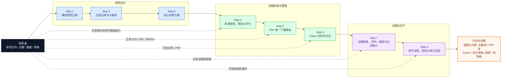
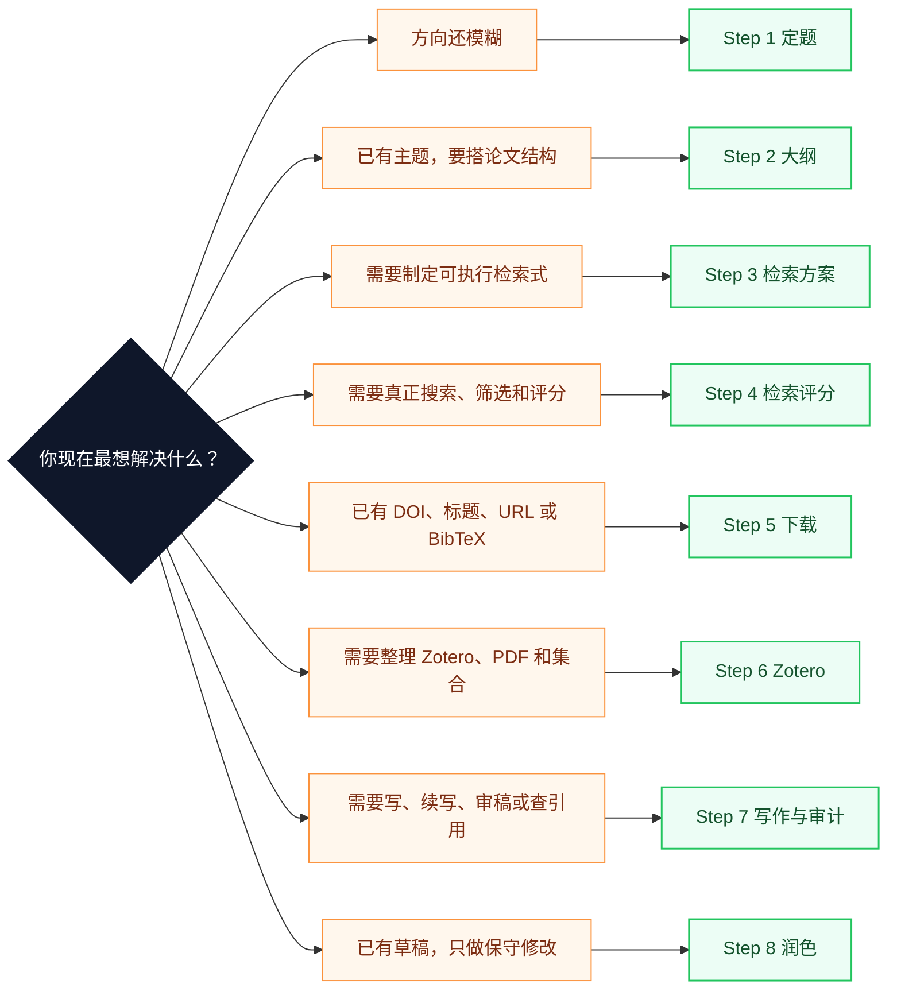
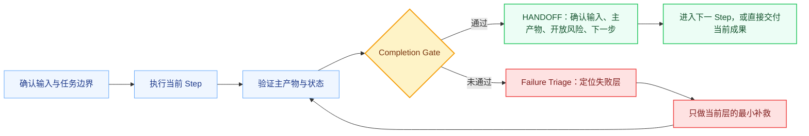

# more-paper-workflow 功能与操作流程图

> 面向 GitHub、插件市场、公众号、技术分享和用户培训的对外说明稿。运行时规则以根目录 `SKILL.md`、`agents/step_*.md` 和 `references/*.md` 为准。

## 一句话定位

`more-paper-workflow` 是一套面向中文与英文学术写作的证据驱动工作流：从模糊研究方向出发，完成定题、大纲、检索、下载、Zotero 整理、证据化写作、科研图表、引用审计和保守润色；已有材料的用户也可以直接进入任意 Step，无需机械地重跑前序流程。

## 对外传播的三个核心卖点

1. **覆盖完整论文链路**：把定题、检索、证据管理、写作和终稿质量控制放在同一套工作流内。
2. **允许任意步骤直达**：已有 DOI、BibTeX、PDF、Zotero 文库或论文草稿时，按当前任务直接进入 Step 4–8。
3. **快速通道不跳质量门**：Checkpoint、证据等级、引用审计、失败分流和 Completion Gate 始终保留。

---

## 图 1：宣传版功能流程图

这张图适合放在 README 首屏、插件市场详情页、演示文稿和公众号文章中。



### 推荐配套文案

> 从“我想研究什么”，到“这句话由哪篇全文证据支撑”，再到“论文是否可以安全定稿”。`more-paper-workflow` 将论文工作拆成 8 个可独立进入、可审计、可恢复的步骤，让 AI 不只会生成文字，也能管理证据、风险和交付状态。

---

## 图 2：详细操作流程图

这张图适合放在使用手册、培训材料或技术架构说明中。

```mermaid
flowchart TB
    START["开始：说明当前目标并提供已有材料"]
    ROUTE{"识别任务意图与材料状态"}
    MODE["选择进入方式<br/>full-workflow / direct-step / plan-only<br/>repair / audit-only / resume"]
    PASS["Artifact Passport<br/>扫描 Step 4–8 材料、缺口与 readiness"]

    START --> ROUTE --> MODE
    MODE -->|"Step 1–3"| P13["读取用户意图与前期研究约束"]
    MODE -->|"Step 4–8"| PASS

    subgraph PHASE1["阶段 A：研究设计"]
        S1A["1.1 研究阶段诊断"]
        S1B["1.2 广度探索与预检索"]
        S1C["1.3 深度聚焦"]
        S1D["1.4 选题预审<br/>原创性 / 重要性 / 可行性"]
        CP1{"CP-TOPIC<br/>确认研究主题与边界"}
        O1["研究主题.md<br/>RQ / scope / 指标 / 可证伪条件"]

        S2A["2.1 判断新建、评审或优化大纲"]
        S2B["2.2 生成章节结构、关键词与证据需求"]
        S2C["2.3–2.6 大纲评审、工程材料映射与术语对齐"]
        CP2{"CP-OUTLINE<br/>确认大纲基线"}
        O2["大纲关键词.md<br/>章节证据需求表"]

        S3A["3.1 将 RQ 拆成 search_tasks"]
        S3B["3.2–3.7 索引复用、概念块、分层检索与来源编译"]
        S3C["3.8 Pilot Search 与 Pre-flight"]
        CP3{"CP-SEARCH<br/>确认来源、范围和检索边界"}
        O3["检索方案.md / 检索方案.json<br/>compiled_queries.json"]

        S1A --> S1B --> S1C --> S1D --> CP1 --> O1
        O1 --> S2A --> S2B --> S2C --> CP2 --> O2
        O2 --> S3A --> S3B --> S3C --> CP3 --> O3
    end

    subgraph PHASE2["阶段 B：证据获取与管理"]
        S4A["4.1 执行多源检索并保留来源日志"]
        S4B["4.2–4.3 可信度标记、引文核验与 DOI 去重"]
        CP44{"CP-SCREENING-BASIS<br/>确认维度、权重、阈值与排除规则"}
        S4C["4.5–4.6 五维评分与 T1–T4 分级"]
        S4D["4.7–4.8 单跳引文扩展、覆盖与饱和分析"]
        S4E["4.9 报告生成与完成检查"]
        O4["workflow_search_results.json<br/>文献表 / BibTeX / 检索报告 / Dashboard"]

        S5A["5.1 解析 DOI、标题、URL、BibTeX 或检索结果"]
        S5B["生成 download manifest 并先 dry-run"]
        LOGIN{"是否需要机构或平台登录？"}
        CP5{"CP-DOWNLOAD-LOGIN<br/>用户完成登录后确认"}
        S5C["按开放获取、出版社、机构会话和中文平台路由"]
        S5D["PDF 校验、尝试日志、失败分类与断点恢复"]
        O5["PDF 附件池<br/>download_manifest.json<br/>download_attempts.jsonl"]

        S6A["6.1 检查 Zotero 能力并选择 local / cloud / skip"]
        S6B["6.2–6.3 生成集合架构、文献映射与附件索引"]
        WRITE{"是否修改 Zotero 外部状态？"}
        CP6{"CP-ZOTERO-WRITE<br/>确认写入范围"}
        S6C["6.4–6.5 创建或复用集合、导入条目、关联附件"]
        S6D["6.6 生成 capability index 并核对重复与缺附件"]
        O6["Zotero 架构与映射<br/>pdf-附件池索引.json<br/>capability_index.json/md"]

        S4A --> S4B --> CP44 --> S4C --> S4D --> S4E --> O4
        O4 --> S5A --> S5B --> LOGIN
        LOGIN -->|"否"| S5C
        LOGIN -->|"是"| CP5 --> S5C
        S5C --> S5D --> O5
        O5 --> S6A --> S6B --> WRITE
        WRITE -->|"否：plan-only"| S6D
        WRITE -->|"是"| CP6 --> S6C --> S6D
        S6D --> O6
    end

    subgraph PHASE3["阶段 C：证据化写作与终稿"]
        S7A["7.1 选择体裁、语言、写作模式与操作轴"]
        S7B["7.2 建立文献证据矩阵"]
        S7C["7.3–7.7 学习目标风格并生成章节蓝图与 argument plan"]
        EVIDENCE{"关键 claim 的证据是否足够？"}
        CP7{"CP-CITATION-WARN<br/>确认降级表达、回补证据或带风险继续"}
        S7D["7.8–7.11 按章节写作、实时引文支撑与防幻觉"]
        FIG{"图表任务类型"}
        FIG0["已有原图：直接插入<br/>backend = not_applicable"]
        FIG1["可信数据新图：quick"]
        FIG2["重绘或数字化：source-locked reproduction"]
        S7E["7.12–7.16 评审、修订、复评与三层引用审计"]
        O7["论文初稿或章节草稿<br/>证据矩阵 / 图表工件 / 引用审计报告"]

        CP8{"CP-POLISH-SCOPE<br/>确认本轮润色范围与保守边界"}
        S8A["8.1 诊断证据缺口、结构漂移、机械表达与引用错位"]
        S8B["8.2–8.3 最小充分修改与验证"]
        S8C["8.4–8.7 修订台账、对照表、一致性和术语终验"]
        S8D["8.8–8.9 可选 DOCX 导出与日志回写"]
        O8["论文润色稿.md/.docx<br/>revision_ledger.json/md<br/>质量报告"]

        S7A --> S7B --> S7C --> EVIDENCE
        EVIDENCE -->|"足够"| S7D
        EVIDENCE -->|"不足"| CP7
        CP7 -->|"回补"| S4A
        CP7 -->|"降级或带风险继续"| S7D
        S7D --> FIG
        FIG --> FIG0 --> S7E
        FIG --> FIG1 --> S7E
        FIG --> FIG2 --> S7E
        S7E --> O7 --> CP8 --> S8A --> S8B --> S8C --> S8D --> O8
    end

    P13 --> S1A
    PASS -->|"推荐 Step 4"| S4A
    PASS -->|"推荐 Step 5"| S5A
    PASS -->|"推荐 Step 6"| S6A
    PASS -->|"推荐 Step 7"| S7A
    PASS -->|"推荐 Step 8"| CP8
    O3 --> S4A
    O6 --> S7A

    O8 --> GATE{"Completion Gate<br/>主产物、状态、风险和下一步输入是否成立？"}
    GATE -->|"通过"| HANDOFF["输出 HANDOFF<br/>confirmed inputs / outputs / risks / next step"]
    GATE -->|"未通过"| TRIAGE["Failure Triage<br/>症状 → 失败层 → 所需证据 → 最小动作"]
    TRIAGE --> ROUTE

    classDef start fill:#0F172A,color:#FFFFFF,stroke:#0F172A,stroke-width:2px;
    classDef route fill:#FFF7ED,color:#7C2D12,stroke:#F97316,stroke-width:2px;
    classDef step fill:#EFF6FF,color:#1E3A8A,stroke:#60A5FA,stroke-width:1px;
    classDef gate fill:#FEF3C7,color:#78350F,stroke:#F59E0B,stroke-width:2px;
    classDef output fill:#ECFDF5,color:#14532D,stroke:#22C55E,stroke-width:1.5px;
    classDef quality fill:#F3E8FF,color:#581C87,stroke:#A855F7,stroke-width:1.5px;

    class START start;
    class ROUTE,MODE,PASS route;
    class S1A,S1B,S1C,S1D,S2A,S2B,S2C,S3A,S3B,S3C,S4A,S4B,S4C,S4D,S4E,S5A,S5B,S5C,S5D,S6A,S6B,S6C,S6D,S7A,S7B,S7C,S7D,S7E,S8A,S8B,S8C,S8D,FIG0,FIG1,FIG2,P13 step;
    class CP1,CP2,CP3,CP44,CP5,CP6,CP7,CP8,LOGIN,WRITE,EVIDENCE,FIG,GATE gate;
    class O1,O2,O3,O4,O5,O6,O7,O8,HANDOFF output;
    class TRIAGE quality;
```



---

## 图 3：用户如何选择入口

对外宣传时，建议明确告诉用户：**先说想做什么，再提供已有材料；系统按任务意图选 Step，而不是按文件扩展名机械路由。**



---

## 八步详细操作表

| Step | 什么时候用 | 最小输入 | 核心动作 | 关键确认点 | 主要产物 |
| --- | --- | --- | --- | --- | --- |
| 1 定题 | 只有方向、问题尚未收敛 | 研究兴趣、对象、约束、当前阶段 | 阶段诊断、探索、预检索、聚焦、选题预审 | `CP-TOPIC` | `研究主题.md` |
| 2 大纲 | 已有主题，需要结构化论文计划 | 研究主题或已有目录 | 生成/评审/优化大纲，建立关键词和章节证据需求 | `CP-OUTLINE`；工程资料模式另有 `CP-ENGINEERING-CONTEXT` | `大纲关键词.md`、章节证据需求表 |
| 3 检索方案 | 需要可执行、可复核的检索设计 | RQ、章节、范围、语言与来源偏好 | 拆分 `search_tasks`，编译来源查询，pilot search，pre-flight | `CP-SEARCH` | `检索方案.md/.json`、`compiled_queries.json` |
| 4 检索评分 | 需要真正获取并筛选文献 | 查询式、已有文献表或最小检索依据 | 多源检索、去重、验证、五维评分、Tier 分层、单跳扩展、饱和与偏差审计 | 正式检索前沿用 `CP-SEARCH`；评分前 `CP-SCREENING-BASIS` | `workflow_search_results.json`、文献表、BibTeX、报告、Dashboard |
| 5 下载 | 已有 DOI、标题、URL、BibTeX 或 Step 4 结果 | 可解析文献标识 | manifest、dry-run、路由、登录门、PDF 校验、失败记录、断点恢复 | 仅登录路径触发 `CP-DOWNLOAD-LOGIN` | PDF 池、`download_manifest.json`、`download_attempts.jsonl` |
| 6 Zotero | 需要建集合、导条目、对附件或只生成计划 | BibTeX/CSL、PDF 池、Zotero 文库或目录目标 | 只读扫描、架构与映射、查重、附件对账、可选写入 | 修改 Zotero 前 `CP-ZOTERO-WRITE` | Zotero 架构、映射、PDF 索引、能力索引 |
| 7 写作 | 需要写全文/章节、续写、评审、修订、绘图或引用审计 | 目标体裁、范围、证据包或草稿 | 证据矩阵、风格蓝图、argument plan、正文、图表路由、评审和引用审计 | 关键证据不足时 `CP-CITATION-WARN` | 草稿、章节、证据矩阵、图表工件、审计报告 |
| 8 润色 | 已有草稿，需要保守精修和终验 | 当前稿件、修改范围、术语/审计材料 | 先诊断，后局部修改；保真、一致性、术语、引用风险与修订台账检查 | `CP-POLISH-SCOPE` | 润色稿、DOCX、`revision_ledger`、质量报告 |

---

## 统一质量闭环

每个 Step 都遵循同一个闭环，而不是以“脚本运行结束”代替“任务完成”。



### 四条不可省略的质量规则

- **证据分级**：候选、元数据、摘要、全文证据不能混用；弱证据不得支撑强 claim。
- **状态分离**：成功、失败、待人工、风险项分别记录；科研图表的提取、渲染和交付状态也分别记录。
- **外部写入确认**：机构登录、Zotero 写入和高风险引用继续使用均有明确 Checkpoint。
- **完成声明过门**：主产物存在、状态清楚、风险公开、下一步输入足够后，才能宣布当前 Step 完成。

---

## 对外演示的三条最短提示词

### 从模糊方向开始

```text
使用 more-paper-workflow，从 Step 1 开始。
我的研究方向是：[方向]。
请先诊断研究阶段，帮我收敛研究问题、范围、评价指标和可证伪条件；到 CP-TOPIC 时停下来让我确认。
```

### 已有 DOI，直接下载

```text
使用 more-paper-workflow，直接进入 Step 5，不重跑前序步骤。
下面是 DOI/标题/URL/BibTeX：[材料]。
请先生成下载 manifest 和 dry-run 摘要；只有确实需要机构登录时才触发 CP-DOWNLOAD-LOGIN。
```

### 已有资料，直接写章节

```text
使用 more-paper-workflow，直接进入 Step 7。
目标体裁：[期刊论文/学位论文/综述]；目标章节：[章节名]；已有材料：[Zotero/PDF/笔记/草稿]。
请先建立最小证据映射和 argument plan，再开始写作；摘要级证据不得支撑具体参数或强机理结论。
```

---

## 对外宣传时建议避免的表述

- 不说“全自动写完论文”，应说“证据驱动的论文全流程协作与质量控制”。
- 不说“任意材料都能直接生成可靠结论”，应说“可直接进入任意 Step，但质量门和证据边界不可跳过”。
- 不用未经当前仓库检查的脚本数量、出版社数量或成功率做宣传。
- 不把“生成草稿”宣传成“证据闭环”或“可以投稿”；应区分 `draft_ready`、`evidence_closed` 和 `ready_for_step8`。
- 不承诺绕过登录、版权或平台权限；Step 5 只做可追溯路由、状态记录和安全恢复。

## 建议的传播组合

| 场景 | 推荐内容 |
| --- | --- |
| README / 插件市场 | 一句话定位 + 三个卖点 + 图 1 + 三条最短提示词 |
| 公众号文章 | 用户痛点 + 图 1 + 八步操作表 + 一个真实案例 |
| 技术分享 / 培训 | 图 2 + 直接入口图 + 质量闭环图 |
| 海报 / 长图 | 图 1 作为主视觉，下面放“任意步骤直达”和三条演示提示词 |
| 用户手册 | 图 2 + 八步操作表 + 各 Step 权威文档链接 |

## 已导出的宣传视觉

- 公众号长图：[`docs/assets/marketing/more-paper-workflow-wechat-long.png`](assets/marketing/more-paper-workflow-wechat-long.png)
- 16:9 演示页：[`docs/assets/marketing/more-paper-workflow-slide-16x9.png`](assets/marketing/more-paper-workflow-slide-16x9.png)
- 中英双语海报：[`docs/assets/marketing/more-paper-workflow-bilingual-poster.png`](assets/marketing/more-paper-workflow-bilingual-poster.png)
- 朋友圈八图：[`docs/assets/marketing/social-carousel/`](assets/marketing/social-carousel/)
- 朋友圈八图总览：[`social-contact-sheet.png`](assets/marketing/social-carousel/social-contact-sheet.png)
- 可编辑源稿：[`docs/assets/marketing/marketing-kit.html`](assets/marketing/marketing-kit.html)
- 朋友圈可编辑源稿：[`social-carousel.html`](assets/marketing/social-carousel.html)
